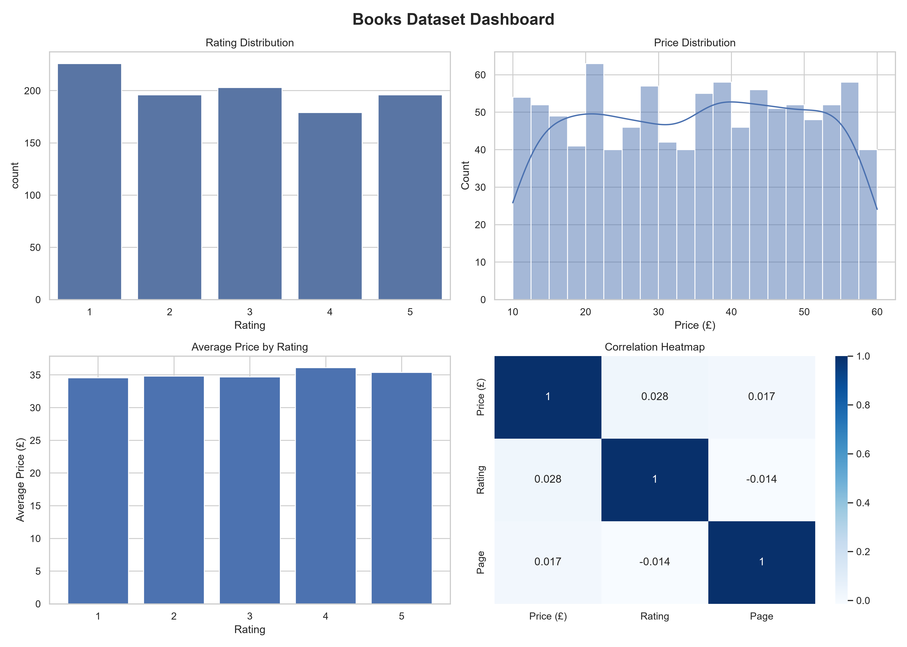
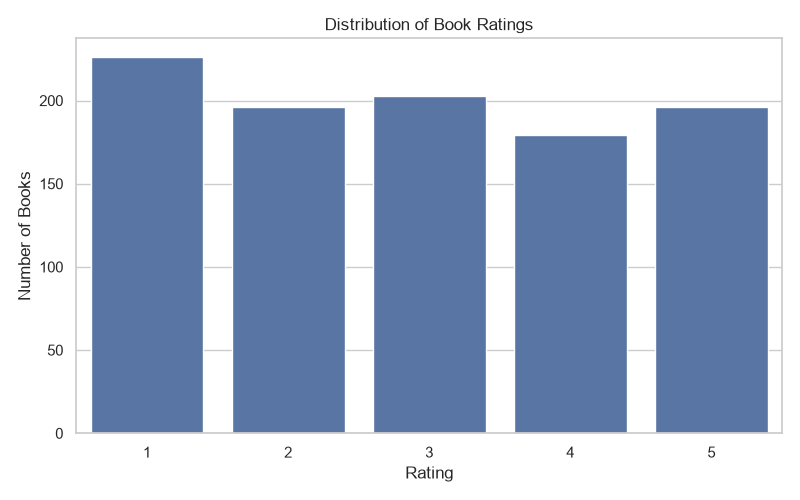
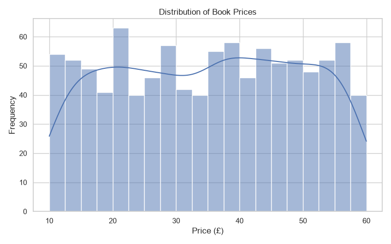
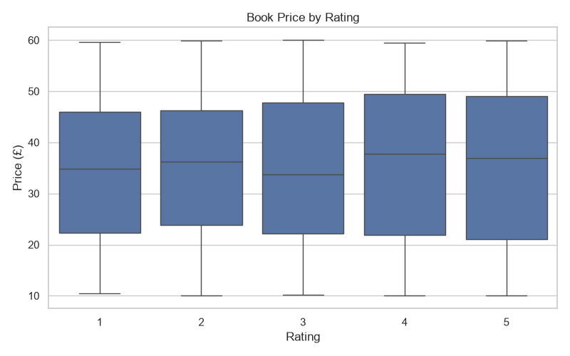
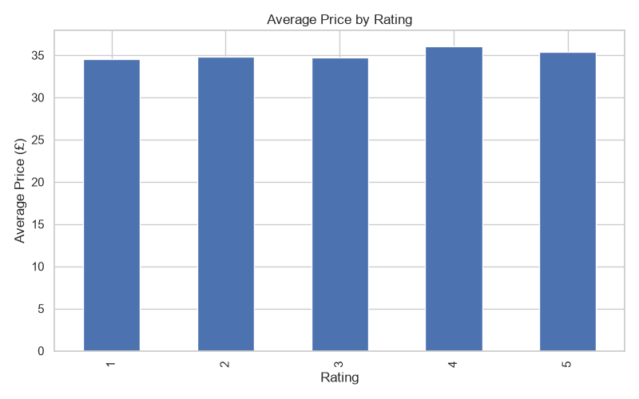
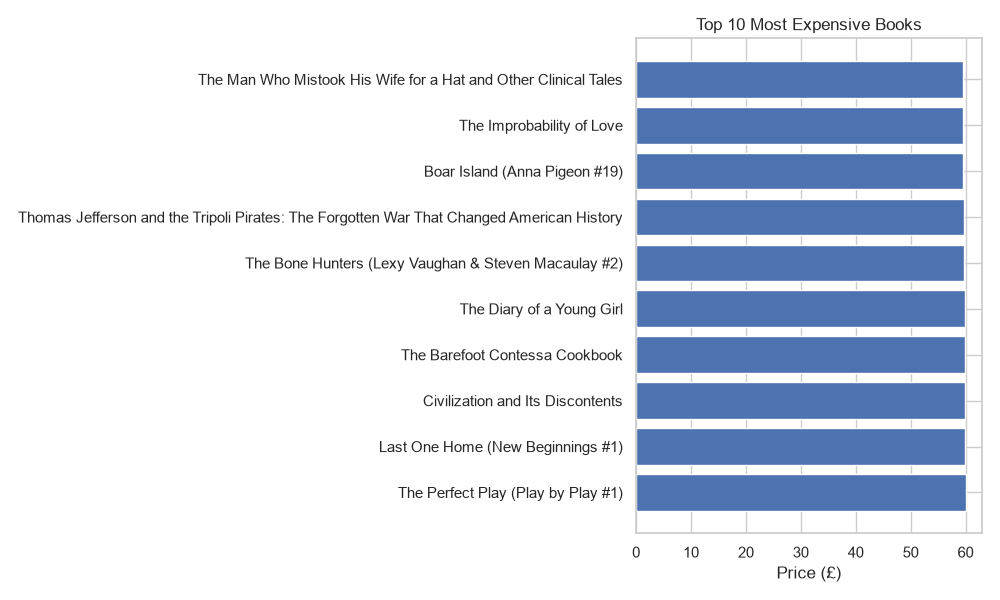
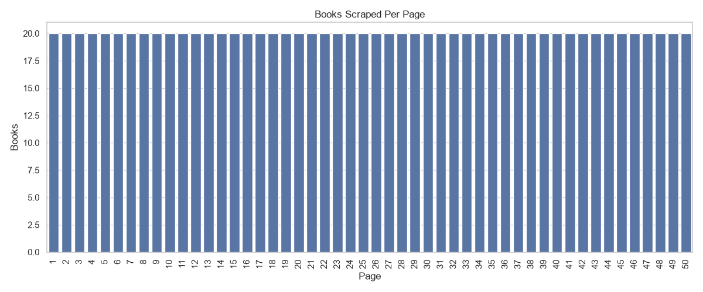
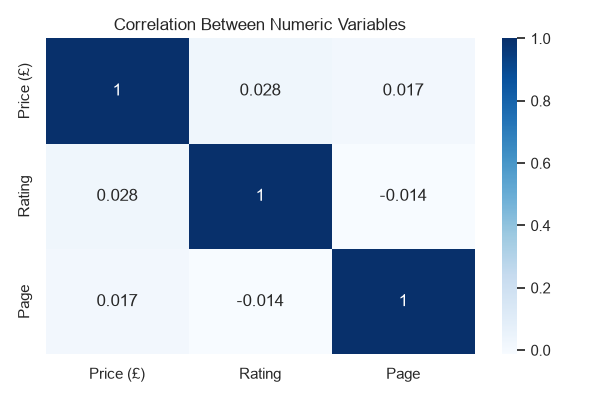
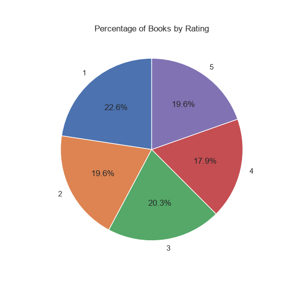

# 📊 Task 3: Data Visualization

## 📌 Project Overview

This project focuses on transforming raw data into meaningful visual representations using Python. The dataset contains information about books collected through web scraping. Various charts and graphs are created to identify trends, patterns, and relationships within the data, making it easier to understand and support decision-making.

---

## 🎯 Objectives

* Transform raw data into visual formats.
* Create informative charts and graphs.
* Identify trends and patterns in the dataset.
* Present insights through clear visualizations.
* Build a portfolio-ready data visualization project.

---

## 🛠️ Technologies Used

* Python 3.13
* Pandas
* Matplotlib
* Seaborn

---

## 📂 Dataset

**Dataset File:** `books_dataset.csv`

### Features

| Feature      | Description                          |
| ------------ | ------------------------------------ |
| Title        | Name of the book                     |
| Price (£)    | Price of the book                    |
| Availability | Stock availability                   |
| Rating       | Book rating (1–5)                    |
| Page         | Page number where the book was found |

---

## 📊 Visualizations Created

The project generates the following visualizations:

1. Rating Distribution
2. Price Distribution
3. Price vs Rating (Box Plot)
4. Average Price by Rating
5. Top 10 Most Expensive Books
6. Books per Page
7. Correlation Heatmap
8. Rating Pie Chart
9. Dashboard

All visualization files are saved inside the **visualizations/** folder.

---

## 📖 Data Story

The visualizations provide meaningful insights into the dataset:

* The **Rating Distribution** chart shows how books are distributed across different rating categories.
* The **Price Distribution** chart highlights the range and frequency of book prices.
* The **Price vs Rating** box plot compares the price distribution for each rating category.
* The **Average Price by Rating** chart shows the average price for books with different ratings.
* The **Top 10 Most Expensive Books** chart identifies the highest-priced books in the dataset.
* The **Books per Page** chart confirms that books were collected consistently across all pages.
* The **Correlation Heatmap** illustrates the relationships between numerical variables.
* The **Dashboard** combines multiple charts into a single visual summary for quick understanding.

These visualizations help transform raw data into actionable insights that support data-driven decision-making.

---

## 📊 Dashboard



---

## 📈 Visualizations

### Rating Distribution



### Price Distribution



### Price vs Rating



### Average Price by Rating



### Top 10 Most Expensive Books



### Books per Page



### Correlation Heatmap



### Rating Pie Chart



---

## 🚀 How to Run

1. Install the required libraries:

```bash
pip install -r requirements.txt
```

2. Run the visualization script:

```bash
python task3_visualization.py
```

3. Open the **visualizations/** folder to view the generated charts and dashboard.

---

## 📌 Key Insights

* Book prices are distributed across a wide range.
* Ratings vary from 1 to 5, with some ratings appearing more frequently than others.
* The dataset contains a balanced collection of books across multiple pages.
* The dashboard provides a consolidated overview of the dataset for quick analysis.
* Visualizations make it easier to identify trends and relationships within the data.

---

## 📚 Learning Outcomes

Through this project, the following skills were demonstrated:

* Data Visualization
* Data Storytelling
* Statistical Visualization
* Dashboard Creation
* Matplotlib
* Seaborn
* Data Interpretation
* Insight Generation

---

## 👨‍💻 Author

**Sarthak Bhangade**

B.Tech – Artificial Intelligence & Data Science

---

## 📄 License

This project was created for educational and internship purposes.
